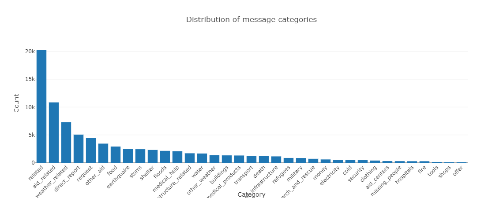

# Disaster Response Pipeline Project
This project builds a website app that deploys a Natural Language Processing pipeline and a classification pipeline. The app has a text input box where one can type a text message. Once submitted, the app analyzes the input text and, in a fraction of a second, it returns a labelling binary output (yes/no, a green shadow = yes) for 36 request categories potentially relevant to disaster response management (i.e medical aid, food, water, shelter, fire, etc).

A quick demo:

### Table of Contents

1. [Installation](#installation)
2. [Project Motivation](#motivation)
3. [File Descriptions](#files)
4. [Results](#results)
5. [Licensing, Authors, and Acknowledgements](#licensing)

## Installation 

To run the app you can either visit the [website](url) where it is deployed or run it locally in your computer.

To run the app locally, you need python 3 and the following python modules installed: flask, plotly, nltk, sklearn, json, pandas, joblib, sqlalchemy, sys, sqlite3, re and pickle.

Once these modules are installed and the repository is cloned, to launch the app navigate to the directory called 'app' and run: `python run.py`. This will launch the Flask app and the terminal will show the url where it can be visited (typically [0.0.0.0:3001](http://0.0.0.0:3001/) or perhaps [127.0.0.1:3001](http://127.0.0.1:3001/))

If you need to re-build the database and train the classifier model, then run the following commands in the project's root directory. Please note that training the model is time-consuming (2-3 hours):

- To run the Extract-Transform-Load pipeline that cleans data and stores it in a database called 'DisasterResponse.db':
    `python data/process_data.py data/disaster_messages.csv data/disaster_categories.csv data/DisasterResponse.db`
- To run a Machine Learning pipeline that trains the classifier and saves the trained model as a Pickle file:
    `python models/train_classifier.py data/DisasterResponse.db models/classifier.pkl`

## Project Motivation

The aim of the project is to build a classifier that quickly tags input text messages from social media posts into 36 possible categories to identify posts coming from people needing humanitarian aid during catastrophes such as earthquakes or others. The aim is to classify each input post text as to know to what various categories it can relate so to quickly connect the post message with particular organizations or response agents (i.e. NGOs providing medical assistance or other types of aid).

This project is the practical assignment of Udacity's Data Scientist nanodegree 'Data Engineering' course. 

## File Descriptions 

The root directory contains the README and LICENSE files and 3 directories called 'data', 'models' and 'app'.

The directory called 'data' contains the dataset and scripts/files related with the ETL stage:
- 2 csv files ('disaster_messages.csv' and 'disaster_categories.csv') that contain +27.000 social media text posts. This is the raw dataset that needs to be wrangled and processed to become ready to train the classifier (see below).
- A ETL pipeline python script ('process_data.py')
- The database with cleaned data that results from running the ETL pipeline ('DisasterResponse.db' or any other name typed when running the ETL pipeline from terminal as explained above)
- A jupyter notebook ('ETL pipeline preparation') showing an initial exploratory data analysis and explaining the data wrangling/cleaning process

The 'models' directory contains files and scripts related with building the machine learning classifier model, its training and evaluation:
- The machine learning pipeline script ('train_classifier') loads the data from the database ('DisasterResponse.db' or other name given when ruynning the ML pipeline from terminal, see above), builds and trains a classifier model, exports the trained model as a Pickle file named 'classifier.pkl' (or other name given in the terminal, as pointed above) and prints in the terminal the classification report for each category and each class including its precision, recall, f1-score and accuracy.
- The pickle file with the trained classifier model ('classifier.pkl' or other name given in the terminal when running the ML pipeline, see above)
- A jupyter notebook ('ML pipeline preparation') explaining the Natural Language Processing and model building, training, tuning and evaluation

The 'app' directory contains the html and Flask app ('run.py') files.

## Results

The website app deploys in its frontpage the distribution of post messages across categories in the dataset used to train the classifier model. When a message is assigned to a category, the value of such category column for that message is 1. Otherwise it is 0. Thus, as shown below, for many of the 36 labeling categories, the labeling is mostly negative and happens in less than 5K post messages (total number of posts = 27K), meaning class imbalance is pervasive in the training dataset:

During model tuning and evaluation I found the best classification performance was obtained with a Logistic Regression model with class_weight set to balanced, which assigns class weights inversely proportional to their respective frequencies. I also tested a Random Forests model and a Multinomial Naive Bayes model. The overal classification results are:
| Parameter | Multinomial Naive Bayes | Random Forests | Logistic regression | 
|--------------------------------------------------------|--|--|--|
| Precision (average of macro averages for all labels)   | 0.67 | 0.79 | 0.68 |
| Recall (average of macro averages for all labels)      | 0.59 | 0.59 | 0.76 | 
| F1 score (average of macro averages for all labels)    | 0.61 | 0.61 | 0.70 |
| Accuracy (average of weighted averages for all labels) | 0.93 | 0.95 | 0.93 |

In conclusion, we consistently see across models a relatively high accuracy and low recall, due to high class imbalance across many labels. We also see that Multimnomial Naive Bayes performs the worst for all the 4 parameters. If we want to maximize precision, we should take the Random Forests classifier. If we want to maximize recall, we should go for the Logistic Regression model. If, as said before, we want to maximize a balance between precision and recall, we would choose the highest F1 score and thus also go for the Logistic Regression classifier, which is the one that has been used in deployment in the 'train_classifier.py' script. The drawback with the Logistic Regression model is that, given its low overall precision (0.68), it will yield a relatively high amount of false positives (i.e. it will incorrectly label input messages assigning them to categories that do not really correspond), however, at least, it will catch most of the true positive rescue enquiry messages given its relatively high overall recall (0.76).

Below some visualizations of the 5 most frequent words found in the training dataset for a selection of labeling categories:
[Top words: 'Related'](img/top-words_related.jpg)
[Top words: 'Aid related'](img/top-words_aid-related.jpg)
[Top words: 'Shelter'](img/top-words_shelter.jpg)
[Top words: 'Missing people'](img/top-words_missing-people.jpg)
[Top words: 'Medical help'](img/top-words_medical-help.jpg)

For more details, see notebook called 'ML pipeline preparation'.

## Licensing, Authors, Acknowledgements
See the [License file](LICENSE). The author is Jose Viosca Ros who thanks Udacity for their support and guidance throughgout the Data Scientist nanodegree.
